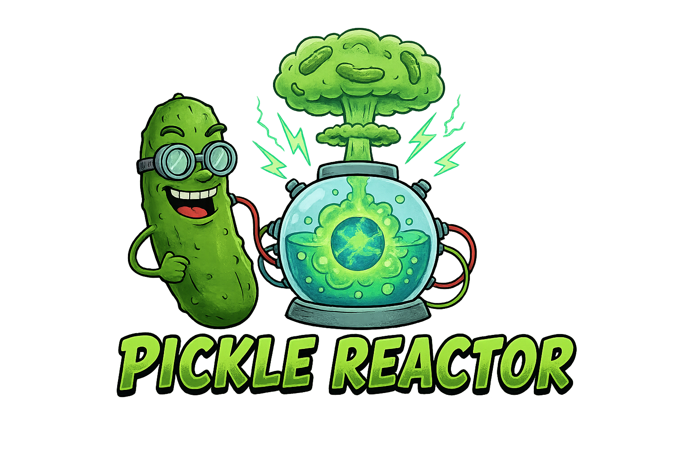

# Pickle-Reactor Framework



> **Next.js-style Python framework using Pyodide and Virtual DOM**

Pickle-Reactor is an experimental Python web framework that brings Next.js-style development patterns to Python. Write your components in Python, render them on the server with SSR, and run them interactively in the browser using Pyodide (Python via WebAssembly).

**Notice**: This was done as a fun experiment. That this idea may be cursed isn't lost on anyone.

## Features

-  **Server-Side Rendering (SSR)** - Fast initial page loads with HTML from Python
-  **Virtual DOM** - Preact-style O(n) diffing algorithm for efficient updates
-  **React-style Hooks** - `use_state()` for component state management
-  **File-based Routing** - Pages automatically route based on file structure
-  **Server Actions** - Call server functions from client with type safety
-  **Data Loading** - Fetch data on server (SSR) or client (hydration)
-  **Interactive Components** - Python runs in browser via Pyodide WebAssembly
-  **Hot Reload** - Development server auto-restarts on file changes
-  **Production Ready** - Build system for deployment

## Quick Start

### Installation

```bash
# Clone or navigate to pickle-reactor directory
cd experiments/pickle-reactor

# Install dependencies (using uv)
uv pip install -e ".[dev]"
```

### Create Your First Page

Create a new file `pages/hello.py`:

```python
from shared.vdom import div, h1, button
from shared.state import use_state

def HelloPage(props):
    """
    A simple counter component demonstrating state management.
    """
    count, set_count = use_state(0)

    return div(
        {},
        h1({}, f"Hello! Count: {count}"),
        button(
            {"on_click": lambda e: set_count(count + 1)},
            "Increment"
        )
    )
```

### Run Development Server

```bash
# Start server with hot reload
python src/pickle_reactor/cli.py dev

# Or specify host/port
python src/pickle_reactor/cli.py dev --host 0.0.0.0 --port 8000
```

Open your browser to `http://localhost:8000` and start building!

## CLI Commands

Pickle-Reactor includes a comprehensive CLI for development and deployment:

```bash
# Show help
python src/pickle_reactor/cli.py --help

# Start development server
python src/pickle_reactor/cli.py dev

# Build for production
python src/pickle_reactor/cli.py build

# Run tests
python src/pickle_reactor/cli.py test

# Show framework info
python src/pickle_reactor/cli.py info
```

### CLI Options

**`dev` - Development Server**
```bash
python src/pickle_reactor/cli.py dev [OPTIONS]

Options:
  --host TEXT      Host to bind (default: 0.0.0.0)
  --port INTEGER   Port to bind (default: 8000)
  --reload/--no-reload  Enable hot reload (default: enabled)
```

**`build` - Production Build**
```bash
python src/pickle_reactor/cli.py build [OPTIONS]

Options:
  --output TEXT    Output directory (default: dist)
  --clean/--no-clean  Clean output directory first (default: enabled)
```

**`test` - Test Suite**
```bash
python src/pickle_reactor/cli.py test [OPTIONS]

Options:
  -v, --verbose           Verbose output
  -m, --markers TEXT      Run tests with specific markers
  --coverage/--no-coverage  Generate coverage report
```

Examples:
```bash
# Run all tests
python src/pickle_reactor/cli.py test

# Run only unit tests (fast)
python src/pickle_reactor/cli.py test -m unit

# Run all except E2E tests
python src/pickle_reactor/cli.py test -m "not e2e"

# Run with coverage
python src/pickle_reactor/cli.py test --coverage
```

## Component Guide

### Creating Components

Components are Python functions that return VNodes (Virtual DOM nodes):

```python
from shared.vdom import div, h1, p, button
from shared.state import use_state

def MyComponent(props):
    """Component with state."""
    # Access props
    title = props.get("title", "Default Title")

    # Use hooks for state
    count, set_count = use_state(0)

    # Return VNode tree
    return div(
        {"class": "container"},
        h1({}, title),
        p({}, f"Count: {count}"),
        button(
            {"on_click": lambda e: set_count(count + 1)},
            "Increment"
        )
    )
```

### Available HTML Elements

Import from `shared.vdom`:

```python
from shared.vdom import (
    # Layout
    div, section, article, header, footer, nav, main,

    # Text
    h1, h2, h3, h4, h5, h6, p, span, strong, em,

    # Forms
    form, input, button, label, textarea, select, option,

    # Lists
    ul, ol, li,

    # Tables
    table, thead, tbody, tr, th, td,

    # Media
    img, video, audio,

    # Links
    a,
)
```

### Props and Attributes

Props are passed as a dictionary:

```python
# HTML attributes
div({"class": "container", "id": "main"}, "Content")

# Inline styles
div({"style": {"color": "red", "fontSize": "16px"}}, "Styled")

# Event handlers (on_* prefix)
button({"on_click": lambda e: print("clicked")}, "Click Me")

# Data attributes
div({"data-id": "123", "data-type": "info"}, "Data")

# Boolean attributes
input({"type": "checkbox", "checked": True})
```

### Children

Components can have children in two ways:

```python
# As additional arguments
div({}, child1, child2, child3)

# As nested VNodes
div(
    {},
    h1({}, "Title"),
    p({}, "Paragraph"),
    button({}, "Action")
)

# Mixed text and components
div(
    {},
    "Some text ",
    strong({}, "bold text"),
    " more text"
)
```

## State Management

### `use_state` Hook

React-style state hook for component state:

```python
from shared.state import use_state

def Counter(props):
    # Initialize state
    count, set_count = use_state(0)

    # Update state
    def increment():
        set_count(count + 1)

    def decrement():
        set_count(count - 1)

    # Reset with new value
    def reset():
        set_count(0)

    return div(
        {},
        h1({}, f"Count: {count}"),
        button({"on_click": lambda e: increment()}, "+"),
        button({"on_click": lambda e: decrement()}, "-"),
        button({"on_click": lambda e: reset()}, "Reset"),
    )
```

### Multiple State Hooks

You can use multiple `use_state` calls in one component:

```python
def Form(props):
    name, set_name = use_state("")
    email, set_email = use_state("")
    age, set_age = use_state(0)

    return form(
        {},
        input({
            "type": "text",
            "value": name,
            "on_input": lambda e: set_name(e.target.value)
        }),
        input({
            "type": "email",
            "value": email,
            "on_input": lambda e: set_email(e.target.value)
        }),
        input({
            "type": "number",
            "value": age,
            "on_input": lambda e: set_age(int(e.target.value))
        }),
    )
```

### State Rules

1. **Only call `use_state` at the top level** - Don't call inside loops, conditions, or nested functions
2. **State updates trigger re-renders** - Component will re-render with new state
3. **State is preserved** - Between re-renders, state values persist
4. **Initial value** - Can be a value or callable: `use_state(lambda: expensive_init())`

## Routing

Pickle-Reactor uses file-based routing similar to Next.js.

### Route Registry

Routes are defined in `server/app.py`:

```python
from pages.index import IndexPage
from pages.about import AboutPage
from pages.todos import TodosPage

ROUTES = {
    "/": IndexPage,
    "/about": AboutPage,
    "/todos": TodosPage,
}
```

### Creating Routes

1. Create a Python file in `pages/` directory
2. Define a component function (e.g., `IndexPage`, `AboutPage`)
3. Register the route in `server/app.py` ROUTES dict
4. Component will render at that URL

Example route:

```python
# pages/profile.py
from shared.vdom import div, h1, p
from shared.state import use_state

def ProfilePage(props):
    return div(
        {},
        h1({}, "User Profile"),
        p({}, "Your profile information")
    )
```

Register in `server/app.py`:

```python
from pages.profile import ProfilePage

ROUTES = {
    # ... other routes
    "/profile": ProfilePage,
}
```

### Navigation

Currently, navigation uses full page reloads (SSR + hydration).

Client-side routing (SPA-style) is planned for a future phase.

## Server Actions

Server actions allow you to call server-side functions from client components.

### Defining Server Actions

Create server action in `server/actions.py`:

```python
from fastapi import APIRouter
from pydantic import BaseModel

router = APIRouter()

class CreateTodoRequest(BaseModel):
    title: str
    completed: bool = False

@router.post("/actions/create_todo")
async def create_todo(payload: CreateTodoRequest):
    # Server-side logic (e.g., database operations)
    todo = {
        "id": generate_id(),
        "title": payload.title,
        "completed": payload.completed
    }
    # Save to database
    return {"ok": True, "todo": todo}
```

### Calling from Client

Use client-side fetch wrapper in `client/actions.py`:

```python
# client/actions.py
from pyodide.ffi import to_js
import js
import json

async def create_todo(title: str):
    """Call server action to create todo."""
    payload = to_js({"title": title, "completed": False})

    response = await js.fetch(
        "/actions/create_todo",
        to_js({
            "method": "POST",
            "headers": {"Content-Type": "application/json"},
            "body": js.JSON.stringify(payload)
        }, dict_converter=js.Object.fromEntries)
    )

    data = await response.json()
    return json.loads(js.JSON.stringify(data))
```

Use in component:

```python
from shared.vdom import div, button, input
from shared.state import use_state

# Import will be available in Pyodide
# from client.actions import create_todo

def TodoForm(props):
    text, set_text = use_state("")

    async def handle_submit(e):
        # Call server action
        result = await create_todo(text)
        if result["ok"]:
            set_text("")  # Clear form

    return div(
        {},
        input({
            "type": "text",
            "value": text,
            "on_input": lambda e: set_text(e.target.value)
        }),
        button({"on_click": handle_submit}, "Add Todo")
    )
```

## Testing

Pickle-Reactor uses a comprehensive 4-tier testing strategy:

### Test Structure

```
tests/
  unit/           Pure Python unit tests (fast)
    test_vdom.py
    test_state.py
    test_patch.py
  integration/    Integration tests with FastAPI
    test_ssr.py
  e2e/            End-to-end browser tests
    test_smoke.py
```

### Running Tests

```bash
# Run all tests
python src/pickle_reactor/cli.py test

# Run specific test tier
python src/pickle_reactor/cli.py test -m unit         # Unit tests only
python src/pickle_reactor/cli.py test -m integration  # Integration tests
python src/pickle_reactor/cli.py test -m e2e         # E2E tests

# Exclude slow tests
python src/pickle_reactor/cli.py test -m "not e2e"

# Run with coverage
python src/pickle_reactor/cli.py test --coverage
```

### Writing Tests

**Unit Tests** (Pure Python, no Pyodide):

```python
# tests/unit/test_myfeature.py
import pytest
from shared.vdom import div, h1

def test_vnode_creation():
    """Test VNode creation."""
    node = div({}, h1({}, "Hello"))
    assert node.tag == "div"
    assert len(node.children) == 1
    assert node.children[0].tag == "h1"
```

**Integration Tests** (FastAPI with httpx):

```python
# tests/integration/test_routes.py
import pytest
from httpx import AsyncClient
from server.app import app

@pytest.mark.asyncio
async def test_home_route():
    """Test home route returns HTML."""
    async with AsyncClient(app=app, base_url="http://test") as client:
        response = await client.get("/")
    assert response.status_code == 200
    assert "text/html" in response.headers["content-type"]
```

**E2E Tests** (Playwright browser automation):

```python
# tests/e2e/test_smoke.py
import pytest
from playwright.async_api import async_playwright

@pytest.mark.e2e
@pytest.mark.asyncio
async def test_counter_interaction():
    """Test counter button increments."""
    async with async_playwright() as p:
        browser = await p.chromium.launch()
        page = await browser.new_page()

        await page.goto("http://localhost:8000")
        await page.click("button#increment")

        count_text = await page.text_content("#count")
        assert count_text == "1"

        await browser.close()
```

## Performance

### Performance Budgets

Pickle-Reactor enforces performance budgets:

- **Bundle Size**: ≤ 2MB (app code, excluding Pyodide core)
- **Hydration Time**: ≤ 1s (after Pyodide loads)
- **Memory Usage**: ≤ 50MB (heap size during operation)

### Optimization Tips

1. **Lazy Load** - Load features only when needed
2. **Key Lists** - Use `key` prop for dynamic lists
3. **Avoid Deep Trees** - Keep component trees shallow
4. **Memoize Callbacks** - Avoid creating new lambdas in render
5. **Profile** - Use Chrome DevTools to identify bottlenecks

### Measuring Performance

```python
# In browser console (after page load)
window.performance.getEntriesByType('navigation')[0]
```

## Project Structure

```
pickle-reactor/
 server/              Server-side code
    app.py          FastAPI application
    ssr.py          Server-side rendering
    actions.py      Server actions

 client/              Client-side code (Pyodide)
    runtime.py      Client runtime (mount, patch, rerender)
    actions.py      Client-side action wrappers

 shared/              Shared code (server + client)
    vdom.py         Virtual DOM (VNode, h(), HTML helpers)
    state.py        State management (use_state, ComponentInstance)

 pages/               Page components (file-based routing)
    index.py        Home page (/)
    about.py        About page (/about)
    todos.py        Todos page (/todos)

 static/              Static assets
    bootstrap.js    Pyodide bootstrap
    *.py            Copied Python modules for Pyodide

 tests/               Test suite
    unit/           Pure Python tests
    integration/    FastAPI integration tests
    e2e/            Playwright E2E tests

 src/pickle_reactor/  CLI package
    __init__.py
    cli.py          CLI commands

 pyproject.toml       Project metadata
```

## Deployment

### Building for Production

```bash
# Build production bundle
python src/pickle_reactor/cli.py build --output dist

# Output structure:
dist/
 server/
 client/
 shared/
 pages/
 static/
```

### Deploying

**Option 1: Uvicorn (single process)**

```bash
cd dist
uvicorn server.app:app --host 0.0.0.0 --port 8000
```

**Option 2: Gunicorn with Uvicorn workers (production)**

```bash
cd dist
gunicorn server.app:app \
  -w 4 \
  -k uvicorn.workers.UvicornWorker \
  --bind 0.0.0.0:8000
```

**Option 3: Docker**

```dockerfile
FROM python:3.11-slim

WORKDIR /app

COPY dist/ /app/
COPY pyproject.toml /app/

RUN pip install --no-cache-dir .

EXPOSE 8000

CMD ["uvicorn", "server.app:app", "--host", "0.0.0.0", "--port", "8000"]
```

### Environment Variables

Configure via environment variables:

- `HOST` - Server host (default: 0.0.0.0)
- `PORT` - Server port (default: 8000)
- `RELOAD` - Enable hot reload (default: false in production)

## Roadmap

### Phase 6: Complete 

- [x] CLI tool (dev, build, test, info)
- [x] Development server with hot reload
- [x] Production build system
- [x] Comprehensive documentation

### Future Enhancements

- [ ] Client-side routing (SPA-style navigation)
- [ ] Suspense and lazy loading
- [ ] Server-side data fetching (getServerSideProps)
- [ ] Static site generation (SSG)
- [ ] Middleware support
- [ ] WebSocket support for real-time features
- [ ] Optimized bundle splitting
- [ ] TypeScript definitions (via stubs)
- [ ] Plugin system

## Contributing

This is an experimental framework developed in the Apothic monorepo.

### Development Setup

```bash
# Navigate to project
cd experiments/pickle-reactor

# Install dependencies
uv pip install -e ".[dev]"

# Run tests
python src/pickle_reactor/cli.py test

# Start dev server
python src/pickle_reactor/cli.py dev
```

### Running Tests

See the [Testing](#testing) section for comprehensive test documentation.

## Architecture

### How It Works

1. **Server-Side Rendering (SSR)**
   - Python components render to HTML on server
   - FastAPI serves initial HTML response
   - HTML includes Pyodide bootstrap script

2. **Hydration**
   - Browser loads Pyodide WebAssembly runtime
   - Python code runs in browser
   - Components "hydrate" - attach event handlers to existing DOM

3. **Interactivity**
   - User interactions (clicks, input) trigger Python event handlers
   - State updates trigger re-renders
   - Virtual DOM diffing algorithm patches real DOM efficiently

4. **Virtual DOM Diffing**
   - Preact-style O(n) algorithm
   - Same-level comparison only
   - Key-based reconciliation for lists
   - Minimal DOM operations for performance

### Technology Stack

**Backend:**
- FastAPI (ASGI web framework)
- Uvicorn (ASGI server)
- Python 3.11+ (server-side Python)

**Frontend:**
- Pyodide 0.24+ (Python via WebAssembly)
- PyScript pydom (DOM abstraction)
- Vanilla JavaScript (bootstrap)

**Testing:**
- pytest (test framework)
- httpx (HTTP client for testing)
- Playwright (E2E browser automation)

## Troubleshooting

### Common Issues

**Pyodide not loading**
- Check browser console for errors
- Ensure CDN is accessible
- Verify network connectivity
- Try different browser (Chrome recommended)

**State not updating**
- Verify `use_state` called at component top level
- Check event handlers attached correctly
- Look for JavaScript errors in console

**Hot reload not working**
- Server restarts automatically (check terminal)
- Manually refresh browser (F5) after restart
- Check file watch permissions

**Tests failing**
- Ensure dependencies installed: `uv pip install -e ".[dev]"`
- Check Python version: `python --version` (requires 3.11+)
- Run specific test tier to isolate: `-m unit`

### Getting Help

- Check existing issues: [GitHub Issues](https://github.com/yourusername/pickle-reactor/issues)
- Review documentation: See `docs/` folder
- Ask in discussions: [GitHub Discussions](https://github.com/yourusername/pickle-reactor/discussions)

## License

Apache License 2.0 - See LICENSE file for details

## Acknowledgments

- **Pyodide Team** - Python in WebAssembly
- **PyScript Team** - pydom DOM abstraction
- **FastAPI** - Modern Python web framework
- **Preact** - Inspiration for VDOM diffing algorithm
- **Next.js** - Inspiration for framework design

---


**Built using Python and Pyodide WebAssembly**
